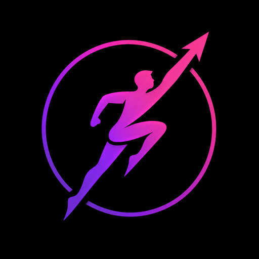

<div align="center">
  
  <h1>🔥 OneUp</h1>
  <p><b>The 365-Day Progressive Fitness Challenge</b></p>
  <p>
    <a href="https://play.google.com/store/apps/details?id=com.lucasm548.oneup">
      
    </a>
    
    
  </p>
</div>

🚀 **OneUp** is a progressive fitness challenge where your daily rep goal increases over 365 days. Complete your exercises every day, build an unbreakable streak, and track your transformation with rich analytics. Compete with friends in Clans, earn achievements, and push your limits — one day at a time.

Available as a **PWA** 🌐 and **Android app** 📱 (Capacitor).

---

## ✨ Features

### 🏋️ Exercise System
- **10 bodyweight exercises** — Pushups, Squats, Pullups, Abs, Jumping Jacks, Lunges, Burpees, Plank, Dips, Mountain Climbers
- **7 weight exercises** (Premium) — Biceps Curl, Hammer Curl, Bench Press, Overhead Press, Squat, Deadlift, Barbell Row
- **2 cardio activities** — Running & Cycling with Strava integration
- **Custom exercises & categories** — Create your own exercises and organize them
- **Camera-based push-up counter** — AI-powered rep counting via your camera
- **Progressive difficulty** — Each exercise has its own multiplier; daily goal = `ceil(day × multiplier × user_difficulty)`
- **Difficulty adjustment** — Per-exercise multiplier override (0.1× to 3×)

### 🎯 Workout Sessions & Routines
- **Session queue** — Build a workout queue with drag-and-drop reordering
- **Routines** — Save and load workout presets (Premium: unlimited, Free: 3 max)
- **Auto-naming** — Smart session names generated from your exercises
- **Session history** — Last 20 sessions synced to the cloud
- **Timer exercises** — Plank and other duration-based movements

### 👥 Social & Gamification
- **Clans** — Create or join clans with a 6-letter code, view member leaderboards, send pokes
- **Global leaderboard** — Ranked by total reps, per-exercise rankings, shield status
- **Shield system** — 🟢 Green = active today, 🟠 Orange = suspicious timestamp (anti-cheat)
- **40 achievement badges** — Streak, volume, perfection, schedule, social & secret categories
- **Special events** — Day 100, 200, 300 milestone celebrations with HUD
- **Share cards** — Generate and share beautiful workout stat cards
- **Pro & Supporter tiers** — Unlock weight exercises, themes, unlimited routines

### 📊 Analytics & Tracking
- **Visual calendar** — See your consistency at a glance with color-coded dots
- **Statistics dashboard** — Total reps, champion exercise, best day, weekly averages
- **Evolution charts** — Per-exercise progress over time
- **Radar chart** — Balanced effort visualization
- **Consistency pie chart** — Workout frequency breakdown
- **Monthly activity chart** — Track your monthly volume
- **Weight progression** — Track weight used per exercise over time
- **Session history** — Browse past workouts with details

### 💎 Premium Features (Pro)
- Weight exercises (barbell/dumbbell movements)
- Unlimited custom routines
- Premium themes (light, colored variants)
- Custom exercise categories
- Priority support

### ☁️ Data & Sync
- **Offline-first** — All data stored locally, synced to cloud when signed in
- **Firebase Realtime Database** — Real-time sync across devices
- **Conflict resolution** — Smart merge of local and cloud data
- **Cloud auto-save** — Changes saved automatically
- **Strava integration** — Sync running/cycling activities with GPS maps

---

## 🛠️ Tech Stack

| Layer | Technology |
|-------|-----------|
| **Framework** | React 19 |
| **Build** | Vite 7 |
| **Mobile** | Capacitor 8 (Android) |
| **State** | Zustand 5 |
| **i18n** | i18next (10 languages) |
| **Icons** | Lucide React |
| **Charts** | Custom SVG + CSS |
| **Maps** | Leaflet + React-Leaflet |
| **Backend** | Firebase Realtime Database |
| **Auth** | Firebase Auth (Google) |
| **Payments** | RevenueCat |
| **Server** | Firebase Cloud Functions |
| **PWA** | vite-plugin-pwa (Workbox) |
| **E2E** | Playwright |
| **Tests** | Vitest + Testing Library |

### 🌍 Supported Languages
English, French, German, Spanish, Italian, Portuguese, Russian, Japanese, Korean, Chinese

---

## 🏗️ Architecture

```
src/
├── components/         # UI components (core, dashboard, exercises, stats, social, settings, admin, feedback)
│   ├── core/           # App orchestrator, error boundary, loading, PWA
│   ├── dashboard/      # Main dashboard, navigation, slides, session bubbles
│   ├── exercises/      # Exercise panel, workout session, custom exercises
│   ├── stats/          # Calendar, charts, highlights, filters
│   ├── social/         # Clans, leaderboard, pokes, user details
│   ├── settings/       # Onboarding, settings panels, store, cloud sync
│   └── admin/          # Admin panel, JSON editor, user management
├── features/           # Domain features
│   ├── cardio/         # Running/cycling with GPS maps
│   ├── events/         # Day 100/200/300 special events
│   ├── announcements/  # In-app announcement system
│   └── share/          # Share card generation
├── hooks/              # Custom React hooks (25+)
├── services/           # Firebase services (auth, dataSync, clan, cardio, strava, purchases)
├── store/              # Zustand stores (progress, settings, exercise, cloud sync, UI)
├── config/             # Exercise definitions, categories, badges, themes, languages
├── contexts/           # React contexts (Auth, Subscription, Exercises)
├── utils/              # Utilities (stats, sync, platform, icons, sound, logger)
├── styles/             # CSS modules + design tokens
└── i18n/locales/       # Translation files (10 languages)

firebase/
└── functions/          # Cloud Functions (leaderboard, revenuecat webhook, strava proxy, admin)
    └── shared/         # Shared code (exercise rules, badge rules, DB schema)
```

### ☁️ Cloud Functions
- **onProgressChange** — Recomputes leaderboard entries when workouts change
- **onCardioChange** — Syncs cardio sessions to leaderboard
- **onSettingsChange** — Updates leaderboard on pseudo/difficulty/visibility changes
- **onPurchaseChange** — Reflects Pro/Supporter status immediately
- **onRevenueCatWebhook** — Verifies and applies subscription changes
- **stravaExchangeToken / stravaRefreshToken** — OAuth proxy (secrets never leave server)
- **onAccountDeleted** — Cleans up all user data on account deletion
- **auditStaleData / pruneStaleData** — Schema-driven stale data management
- **backfillUserProfiles** — Admin utility for profile data recovery

### 🗄️ Database Schema
Firebase RTDB structure is defined and documented in `firebase/functions/shared/dbSchema.js` with a dedicated path builder (`paths`) used by both client and server — no hardcoded path strings.

---

## 🚀 Getting Started

```bash
git clone https://github.com/LucasM548/OneUp.git
cd OneUp
npm install
npm run dev
```

### 📋 Prerequisites
- Node.js 18+
- Android SDK (for native build)

### 🔐 Environment Variables
Copy `example.env` to `.env` and configure:
- Firebase project config
- RevenueCat API keys
- Strava client ID

---

## 📦 Available Commands

| Command | Description |
|---------|-------------|
| `npm run dev` | Start Vite dev server |
| `npm run build` | Build web app (PWA) to `dist/` |
| `npm run build:bundle` | Build signed Android App Bundle (AAB) |
| `npm run build:apk` | Build debug APK |
| `npm run build:apk:dev` | Build dev flavor APK |
| `npm run deploy:android` | Deploy to connected Android device |
| `npm run preview` | Preview production build |
| `npm run lint` | Run all 8 quality checks |
| `npm test` | Run unit/integration tests |
| `npm run test:coverage` | Run tests with coverage report |
| `npm run test:e2e` | Run Playwright E2E tests |
| `npm run deploy` | Deploy to GitHub Pages |
| `npm run deploy:functions` | Deploy Firebase Cloud Functions |
| `npm run deploy:hosting` | Deploy Firebase Hosting |

---

## Code Quality

Eight automated checks run in sequence via a single `npm run lint`:

```
╔════════════════════════════════════════════════════════════════════════╗
║                      RAPPORT GLOBAL DE VALIDATION                      ║
╠════════════════════════════════════════════════════════════════════════╣
║  1. 🔍 ESLint                                        ✓ SUCCÈS (23.89s) ║
║  2. ✂️ Knip (Code mort/Fichiers inutilisés)            ✓ SUCCÈS (1.54s) ║
║  3. 🌐 check-i18n-keys                                ✓ SUCCÈS (0.05s) ║
║  4. ⚖️ check-i18n-consistency                          ✓ SUCCÈS (0.04s) ║
║  5. 🎨 check-unused-css                               ✓ SUCCÈS (0.12s) ║
║  6. 💅 Stylelint (lint:css)                           ✓ SUCCÈS (0.68s) ║
║  7. 🔄 Dépendances circulaires (lint:circular)        ✓ SUCCÈS (1.21s) ║
║  8. 👥 Duplication de code (lint:dup)                 ✓ SUCCÈS (0.16s) ║
╠════════════════════════════════════════════════════════════════════════╣
║  ✅ TOUS LES TESTS SONT AU VERT !                                      ║
╚════════════════════════════════════════════════════════════════════════╝
```

| # | Tool | What it checks |
|---|------|----------------|
| 1 | 🔍 **ESLint + SonarJS** | JS/React syntax, bugs, cognitive complexity |
| 2 | ✂️ **Knip** | Unused files, dead exports, orphaned dependencies |
| 3 | 🌐 **check-i18n-keys** | Translation key coverage vs reference (`en.json`) |
| 4 | ⚖️ **check-i18n-consistency** | Structural consistency across all 10 languages |
| 5 | 🎨 **check-unused-css** | Dead CSS class detection |
| 6 | 💅 **Stylelint** | CSS best practices & syntax |
| 7 | 🔄 **Madge** | Circular import detection |
| 8 | 👥 **Jscpd** | Code duplication (DRY enforcement) |

## 🧪 Testing
- **Unit/Integration**: Vitest + Testing Library (80%+ coverage required)
- **E2E**: Playwright covering critical user flows (navigation, onboarding, workout, social)

---

## 🤝 Contributing

1. Fork the repository
2. Create a feature branch (`git checkout -b feature/amazing-idea`)
3. Commit your changes (`git commit -m 'feat: add amazing idea'`)
4. Push to the branch (`git push origin feature/amazing-idea`)
5. Open a Pull Request

All contributions are welcome — new exercises, UI improvements, features, or bug fixes.

---

## 📄 License

Distributed under the **MIT License**. See [LICENSE](./LICENSE) for details.

---

<div align="center">
  <p>Built with ❤️ by <a href="https://github.com/lucas-martinati">Lucas Martinati</a> — Vibe Coded 🎧✨</p>
</div>
